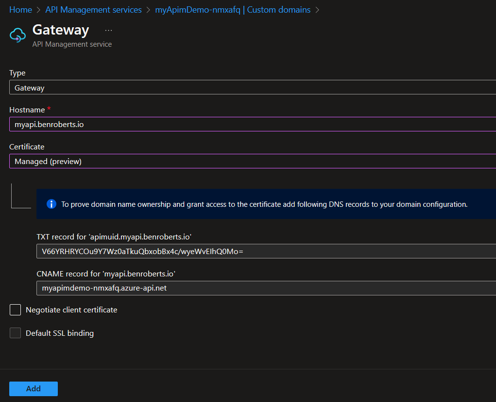
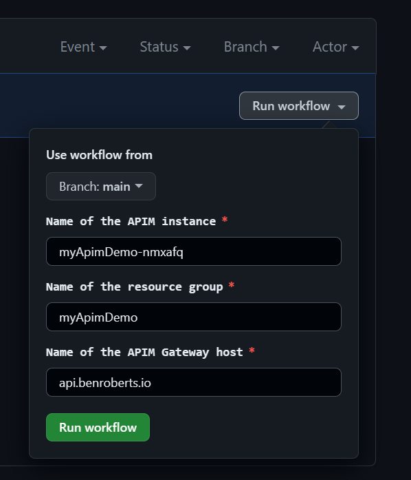
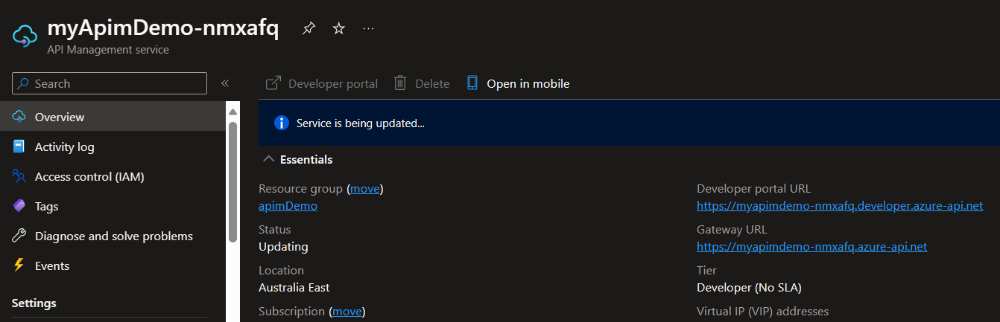
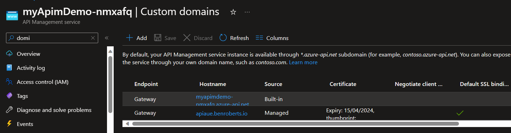
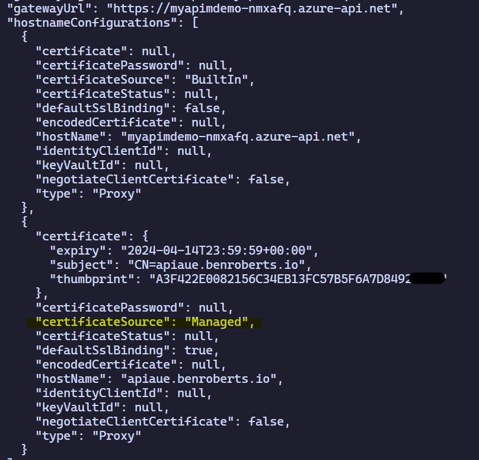

# Azure API Mangament - Managed Certificates (Preview)

Azure API Management is a great service to manage your APIs. It provides features like throttling, caching, logging/insights and much more. One of the features is the ability to use custom domains and SSL certificates. In this post I will show you how to use the "free" managed certificates in Azure API Management.

Managed certificate support for Azure API Management has been in preview since January 2022 but there isn't much documentation about it. In this post I will show you how to use managed certificates in Azure API Management and we'll automate the process using bicep and GitHub Actions.

Managed certificate's require the APIM to be deployed before configuration. So we'll be completing the following steps in this blog:

- Deploy an APIM bicep with GitHub Actions
- Retrieve the domain validation token
- Deploy the custom domain and managed certificate using GitHub Actions

## Prerequisites

To follow along with this post you need the following:

- An Azure subscription
- GitHub account
- A custom domain

## Create an Azure API Management instance

First we need to create an Azure API Management instance. I've created the code in bicep which will create an Azure API Management instance and all the supporting resources. You can find the full code in my [GitHub repository](https://github.com/broberts23/apim-managed-certs) for this post.

I won't go throught the code in detail but I will highlight a few things. All the parameters are specified in the `main.bicepparams` file. This is a new yaml-like format that is a huge imporovment over JSON files. You can find more information about the new format [here](https://learn.microsoft.com/en-us/azure/azure-resource-manager/bicep/parameter-files?tabs=Bicep)

The `main.bicep` file contains the resource blocks to create the Azure API Management instance. I'm deploying a Developer tier instance using internal VNET integration. This is a complex deployment and requires a very sepcific list of requirments. You can find more information about the prerequisites [here](https://learn.microsoft.com/en-us/azure/api-management/api-management-using-with-internal-vnet?tabs=stv2s). The hightlights are:

    - A virtual network with a subnet containing no delegations, and service endpoints for Event Hubs, Storage, SQL, Key Vault, and Service Bus. 
    - A private DNS zone with a link to the above virtual network.
    - A public IP address with a DNS name label.
    - An NSG with rules to allow traffic from the Azure API Management subnet to the Microsoft management plane (Gateway, LoadBalancer) and to the above service endoints.

At the time of writing there's a bug in the portal deployment that prevents you from deploying an Azure API Management instance with internal VNET integration. The bug is that the portal deploys a subnet with a delegation set to Microsoft/serverfarms. The wizard also doesn't cater for the private DNS zones. A private DNS zone vnet link is required for successful activation.

Deployment is managed by GitHub Actions. I've provided an example in .github\workflows\deploy-infra.yml. The workflow uses OIDC Authentication to authenticate to Azure and GitHub environments for approvals. If you're unfamilar with the OIDC configuration or Approval workflows, I wrote a blog series about it [here](https://benroberts.io/2023/10/05/azure-mlops-challenge-blog-index/). 😄

## Finding the APIM validation token

Once the deployment is complete, you need to find the unique TXT record of your Azure API Management instance to create DNS validation records. You can find the unique string in the Azure portal by navigating to your Azure API Management instance and selecting Custom domains. Create a new custom domain and change the Type to "Gateway" and change the Certificate type to "Managed (preview)". You will see the unique string in the DNS validation record.

The validation token is used to validate domain ownership. So you only need to create the DNS validation record once and you can use it for multiple CNAME records.

Don't click Add. We're going to automate this process using GitHub Actions. 🚀

Creating DNS records is a manual process with your domain hosting provider and is beyond the scope of this post. Most providers have excellent documentation on how to create TXT and CNAME records. You'll need to add the TXT validation record and CNAME record pointing to your "Hostname".

## Applying the hostname configuration to Azure APIM

When running the deploy-cert workflow, you will be prompted for the host configuration parameters.

The Azure CLI command will create the Gateway endpoint with the custom domain and validate the domain during execution. The APIM will then go into an "Updating" phase for 15-20 minutes while the certificate is generated and the hostname configuration is applied. You can find the full code in .github\workflows\deploy-cert.yml

After the command completes, you can navigate to your Azure API Management instance and select Custom domains. You will see the custom domain with the "free" managed certificate!

We can also view the JSON response and validate the configuration:

## Certificate renewal

If you're like me, this question you're asking yourself is "How do I renew the certificate?". The answer is that you don't need to! 🥳 The certificate is managed by Azure and will be renewed automatically so long as you don't change the CNAME and TXT records.

## Conclusion

In this post I showed you how to create a managed SSL certificates in Azure API Management. I also showed you how to automate the process using bicep, GitHub Actions and Azure CLI. I hope you found this post useful, I had a lot of fun creating it. 🙌 

If you want to read more about APIM custom domains and certificate you can find the documentation [here](https://learn.microsoft.com/en-gb/azure/api-management/configure-custom-domain?tabs=managed).